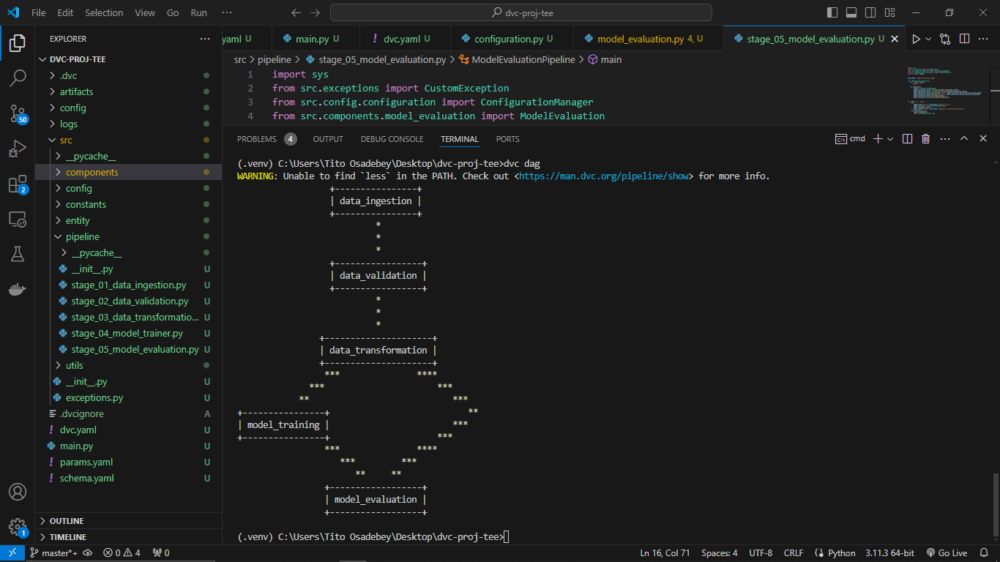

# Wine Quality Classification DVC Implementation

## Overview

This project focuses on using DVC for pipeline management and control while building an ML project. This implementation uses the local device as storage.

## Usage
1. Clone this repository to your local machine:
```
git clone https://github.com/titoausten/Wine-Quality-Classification-DVC-Implementation.git
```

2. Install requirements:
```
pip install -r requirements.txt
```

3. Initialize DVC:
```
dvc init
```

4. View pipelines to be created and the relationship between pipelines (optional):
```
dvc dag
```


5. Add local backend store (optional):
```
dvc remote add -d local path/to/preferred/directory
```

6. Start pipeline to run ML project:
```
dvc repro
```
### Note: For Module not found error, set PYTHONPATH to project directory.
- Command Prompt implementation
```
set PYTHONPATH=%;C:\Path\to\Wine-Quality-Classification-DVC-Implementation
```
- Linux/bash implementation
```
export PYTHONPATH=\Path\to\Wine-Quality-Classification-DVC-Implementation
```

7. View evaluation metrics:
```
dvc metrics show
```

8. Create plots:
```
dvc plots show
```


## License
This project is licensed under the MIT License. See the LICENSE file for more details.
